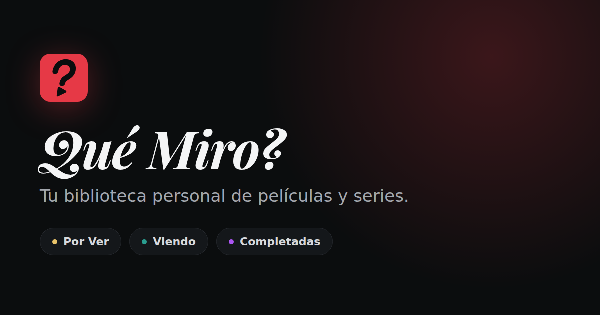
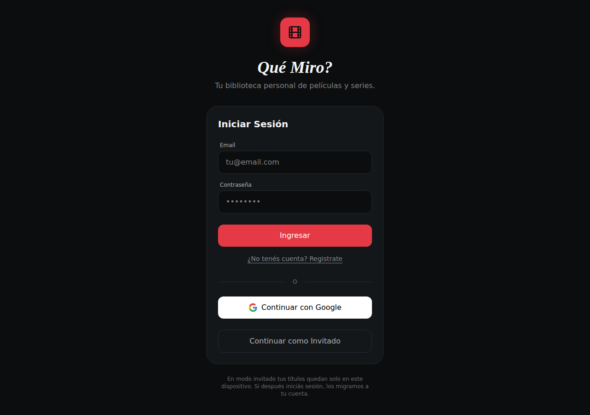
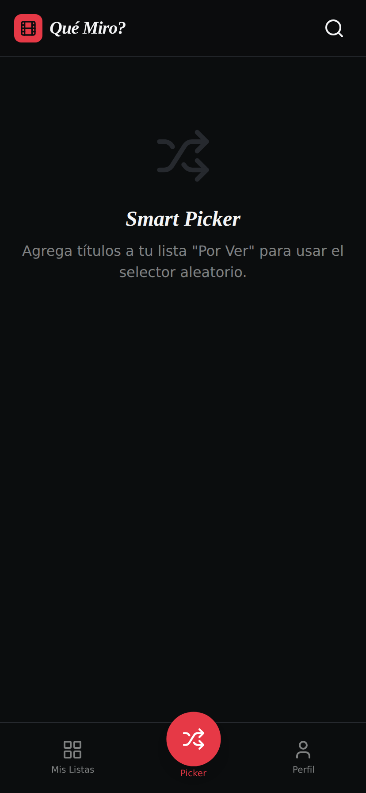

<div align="center">
  
  <p><em>Tu biblioteca personal de películas y series.</em></p>
</div>

# Qué Miro?

Webapp para llevar el registro de lo que querés ver, lo que estás viendo y lo que
ya terminaste — con reseñas propias y un selector aleatorio para las noches en
las que no sabés qué mirar.

Funciona como PWA instalable, sincroniza entre dispositivos si iniciás sesión, y
se puede usar sin cuenta: en modo invitado todo queda guardado en el navegador.

---

## Features

- **Tres listas** — *Por Ver*, *Viendo* y *Completadas*, con transiciones animadas.
- **En pausa y abandonadas** — lo que dejaste para después o no pensás
  terminar vive aparte, en *Archivadas*, con desde cuándo y, si abandonaste,
  el motivo y un puntaje de lo que viste. Sale de "Continuar viendo" y del
  picker; lo abandonado, también del calendario, y el feed te muestra menos
  de lo parecido. Una serie en *Viendo* que lleva dos meses quieta pregunta
  si la ponés en pausa; nunca lo hace sola.
- **Continuar viendo** — arriba de todo, las series para retomar con el
  episodio que toca y un "+1" para marcarlo sin abrir la ficha, con su
  "Deshacer". Si era el último, ofrece la reseña.
- **Búsqueda en TMDB** — películas y series, con atajo `⌘K` / `Ctrl+K`. Cada
  resultado abre su ficha de un toque, o va directo a *Por Ver* o a
  *Completadas* desde los dos botones de al lado. Marcar algo como completado
  abre la reseña ahí mismo.
- **En tu castellano** — títulos y sinopsis en latino o en castellano de
  España, según el país que elijas: desde Buenos Aires es *Duro de matar*, no
  *La jungla de cristal*. Lo que ya tenías guardado se corrige solo, de a poco.
- **Filtros y orden** — buscá dentro de tus listas y filtrá por género, tipo,
  plataforma, lista o ánimo. Los filtros viven en la URL, así que la vista se
  puede compartir.
- **Llegó a tu plataforma** — cuando algo de *Por Ver* llega a una de tus
  plataformas, o una película que anotaste antes de que saliera se estrena
  en digital, aparece en "Novedades" al abrir la app. Se descarta con un
  toque y no vuelve.
- **Tus plataformas** — marcá en Ajustes, con sus logos, las plataformas que
  pagás. "Lo que puedo ver ya" filtra la biblioteca y el picker por lo que
  está incluido en ellas (no en alquiler), la ficha separa "Incluido en" de
  "Alquiler o compra", y Explorar muestra primero su catálogo.
- **Ficha del título** — sinopsis, reparto, tráiler y en qué plataformas está
  disponible, según el país que elijas, con un enlace a la página que lleva
  directo a cada una.
- **Progreso de series** — marcá episodios de a uno o por temporada entera, con
  barra de progreso y un "vas por T2E5" para retomar donde dejaste. Cada
  temporada muestra sus episodios con nombre, fecha, duración e imagen; lo que
  todavía no salió aparece con su fecha, y la sinopsis de lo que no viste queda
  escondida hasta que la pedís.
- **Puntaje por episodio** — cada episodio visto se puede puntuar mientras
  mirás la serie; la ficha muestra tu mejor episodio, tu peor y el promedio de
  cada temporada.
- **Al día y novedades** — una serie que sigue saliendo no se "termina": si
  viste todo lo emitido, estás al día, y el porcentaje se cuenta contra lo que
  ya salió. Cuando una serie que terminaste estrena temporada, la tarjeta avisa
  —"T3 nueva", "2 episodios nuevos"— y ofrece volver a *Viendo*; en *Mis
  listas* se pueden filtrar las que tienen episodios nuevos.
- **Reseñas propias** — puntaje de 0,5 a 5 estrellas (con medias estrellas),
  comentario y etiquetas de ánimo.
- **Historial de visionados** — volver a ver algo suma una entrada nueva en vez
  de pisar lo que habías escrito la primera vez.
- **Listas propias** — agrupaciones más allá de los tres estados: "maratón del
  finde", "pendientes de terror". Se arman desde la ficha de cualquier título,
  esté o no en tu biblioteca.
- **Explorar** — un feed que se arma con tu biblioteca y con lo que nos
  contaste: otros trabajos del director que puntuaste alto, más de esa actriz
  que aparece en dos de tus favoritas, lo que se parece a tu película favorita,
  el catálogo de tu productora, el género que venís mirando, la parte de la
  saga que te falta, la serie que dejaste a medias. Son 34 recetas distintas,
  barajadas en cada visita y cargadas de a tandas mientras scrolleás. Desde la
  ficha lo guardás en *Por Ver* o en *Completadas* de un clic, o directo en una
  de tus listas; si lo completaste, la reseña se abre sola.
- **Contanos de vos** — siete preguntas en el perfil —tu película, tu serie,
  tus géneros, tus actores, tus directores, tus productoras, tu década— que
  Explorar convierte en filas nuevas. Es lo que hace que la pestaña sea tuya
  desde el primer día, antes de tener una sola estrella puesta.
- **Avisos de episodios** — prendé "Avisame de episodios nuevos" en la ficha
  de una serie (o elegilas en Ajustes) y el día que sale un episodio te llega
  una notificación que abre su ficha; si salen varias, un solo aviso que las
  nombra. El servidor solo ve los ids de esas series, nunca tu biblioteca. En
  iPhone y iPad funciona con la app instalada en la pantalla de inicio.
- **Calendario** — lo que sale de las series que seguís y lo que tenés en *Por
  Ver* con fecha de estreno, agrupado en hoy, esta semana, las próximas y más
  adelante. Una temporada que se estrena entera se ve como tal, y las que
  siguen en emisión sin fecha van aparte.
- **Tu calendario en la agenda** — una dirección `.ics` para suscribirte desde
  Google Calendar, Apple Calendar u Outlook: los próximos episodios aparecen
  solos como eventos de todo el día, y se actualizan cuando abrís la app. Si
  la compartiste de más, se genera una nueva y la anterior deja de andar.
- **Smart Picker** — elige al azar de tu lista *Por Ver*, filtrando por duración,
  tipo, género, plataforma, lista o ánimo.
- **Modo duelo** — comparaciones de a dos que arman un ranking de tu lista, con
  puntaje tipo Elo.
- **Estadísticas** — horas mirando, distribución por género, actividad por mes y
  cómo puntuás, con su tabla accesible al lado de cada gráfico. Cada episodio
  guarda cuándo lo marcaste, así que una serie que miraste todo agosto suma en
  agosto, y un mapa de actividad muestra los días que miraste algo. Si
  abandonaste algo, también cuánto abandonás y después de cuántos episodios
  solés dejar una serie.
- **Metas y rachas** — una meta para el año (películas, series u horas) que
  se mide contra el ritmo —"vas 2 películas abajo del ritmo"—, y la racha de
  semanas seguidas mirando algo. Se sincronizan con la cuenta y, cuando
  cumplís una, hay tarjeta para compartir.
- **Tu año en Qué Miro?** — resumen anual listo para compartir, con tu
  episodio del año, las metas que cumpliste y tu mejor racha.
- **Perfil público** — publicá tus estadísticas y reseñas en `/u/tu-nombre`, con
  su vista previa resuelta del lado del servidor.
- **Offline de verdad** — sin conexión seguís usando la app, y los cambios se
  sincronizan solos cuando vuelve la red.
- **Modo demo** — una biblioteca de ejemplo para recorrer la app sin registrarte.
- **Modo invitado** — usala sin cuenta; si después iniciás sesión, tu biblioteca se migra sola.
- **Tus datos son tuyos** — exportá a JSON o CSV, reimportá el JSON y eliminá tu
  cuenta con todos sus datos cuando quieras.
- **Tema claro y oscuro** — sigue al sistema o se fija a mano.
- **Accesible** — navegable por teclado, con foco atrapado en los modales y
  respeto por `prefers-reduced-motion`.
- **PWA** — instalable en el celular, con los pósters cacheados para uso offline.

<div align="center">
  
  
</div>

---

## Stack

| Capa | Herramientas |
|---|---|
| UI | React 19, TypeScript (`strict`), Tailwind CSS 4, Motion, lucide-react |
| Rutas | React Router 7 |
| Estado | Zustand (con persistencia en `localStorage`) |
| Datos | [TMDB API](https://www.themoviedb.org/documentation/api) vía funciones serverless |
| Auth y sync | Firebase Auth + Cloud Firestore |
| Build | Vite 6, vite-plugin-pwa (Workbox) |
| Tests | Vitest + Testing Library, Playwright para los E2E |
| Deploy | Vercel |

---

## Cómo correrlo

**Requisitos:** Node.js 20 o superior.

```bash
git clone https://github.com/nicolizaso/que-miro.git
cd que-miro
npm install
cp .env.example .env.local   # completá las claves (ver abajo)
npm run dev                  # http://localhost:3000
```

### Variables de entorno

Solo **TMDB** es obligatoria. Sin Firebase la app arranca igual, directamente en
modo invitado.

| Variable | Obligatoria | Para qué |
|---|---|---|
| `TMDB_API_KEY` | Sí | Buscar títulos y traer sus fichas. Se pide [acá](https://www.themoviedb.org/settings/api). |
| `VITE_FIREBASE_*` | No | Login y sincronización entre dispositivos. |
| `VITE_FIREBASE_VAPID_KEY` | No | Avisos de episodios: la clave pública de *Certificados push web*. Sin ella la app no ofrece avisos. |
| `FIREBASE_ADMIN_CLIENT_EMAIL` | Para avisos | Cuenta de servicio con la que el cron lee las suscripciones y manda los avisos. |
| `FIREBASE_ADMIN_PRIVATE_KEY` | Para avisos | La clave privada de esa cuenta de servicio (con los `\n` tal cual vienen en el JSON). |
| `FIREBASE_ADMIN_PROJECT_ID` | No | Solo si el proyecto del servidor no es el de `VITE_FIREBASE_PROJECT_ID`. |
| `CRON_SECRET` | Para avisos | Un texto largo al azar. Vercel lo manda en cada corrida del cron, y sin él el cron no corre. |

> **Sobre las claves:** `TMDB_API_KEY` no lleva prefijo `VITE_` a propósito — la
> usa únicamente el servidor, así nunca termina en el bundle que se descarga el
> navegador. Las `VITE_FIREBASE_*` sí son públicas por diseño: en Firebase la
> seguridad real la dan las reglas de Firestore ([`firestore.rules`](firestore.rules))
> y la lista de dominios autorizados en la consola. `FIREBASE_ADMIN_*` y
> `CRON_SECRET`, en cambio, son secretos de servidor: nunca con prefijo `VITE_`.

### Configurar Firebase (opcional)

1. Creá un proyecto en la [consola de Firebase](https://console.firebase.google.com/).
2. En **Authentication**, habilitá los proveedores *Email/Password* y *Google*.
3. En **Firestore**, creá la base y publicá las reglas de [`firestore.rules`](firestore.rules).
   Este paso no es opcional: sin base, el SDK falla con
   `Database '(default)' not found`, la app guarda todo en la caché local del
   navegador y *parece* andar, pero nada llega al servidor y los dispositivos
   nunca se ven entre sí. Si tu proyecto tiene una base con nombre en vez de la
   `(default)`, poné ese nombre en `VITE_FIREBASE_DATABASE_ID`.

   Las reglas del repositorio no se publican solas: copiarlas en la pestaña
   **Reglas** de la consola y darle *Publicar*, o desplegarlas desde acá, que
   es lo reproducible (usa [`firebase.json`](firebase.json)):

   ```bash
   npx firebase-tools deploy --only firestore:rules --project TU_PROJECT_ID
   ```

   Si quedan sin publicar, Firestore contesta
   `Missing or insufficient permissions` y la app avisa con un cartel.
4. En **Authentication → Settings → Authorized domains**, agregá tu dominio de
   producción (si no, el login con Google falla con `auth/unauthorized-domain`).
5. Copiá las credenciales del proyecto a tu `.env.local`.

El modelo de datos está documentado en [`firebase-blueprint.json`](firebase-blueprint.json).

### Configurar los avisos de episodios (opcional)

Los avisos son tres piezas: el navegador se suscribe con Firebase Cloud
Messaging, guarda en `push_subscriptions/{uid}` sus tokens y los ids de las
series con aviso, y un cron diario en Vercel ([`api/cron/notify.ts`](api/cron/notify.ts))
lee eso, le pregunta a TMDB qué sale hoy y manda los avisos. El cron no lee
`saved_media`.

1. En la consola de Firebase, **Configuración del proyecto → Cloud Messaging →
   Certificados push web**, generá el par de claves y copiá la pública en
   `VITE_FIREBASE_VAPID_KEY`.
2. En **Cuentas de servicio**, generá una clave privada nueva. Del JSON que se
   descarga, `client_email` va en `FIREBASE_ADMIN_CLIENT_EMAIL` y
   `private_key` en `FIREBASE_ADMIN_PRIVATE_KEY`. Ese archivo no se commitea.
3. Inventá un `CRON_SECRET` largo (`openssl rand -hex 32`) y cargalo en Vercel.
4. Publicá las reglas: `push_subscriptions` tiene las suyas.

El cron corre todos los días a las 13:00 UTC (`crons` en [`vercel.json`](vercel.json)).
Para probarlo a mano, en local o contra el deploy:

```bash
curl -H "Authorization: Bearer $CRON_SECRET" http://localhost:3000/api/cron/notify
```

En desarrollo no hay service worker, así que activar los avisos se prueba
con el build (`npm run build && npm run preview`) o en el deploy. En iPhone y
iPad las notificaciones web existen solo para la app instalada en la pantalla
de inicio (iOS 16.4 o más nuevo): la app lo explica en vez de mostrar el botón.

---

## Scripts

| Comando | Qué hace |
|---|---|
| `npm run dev` | Server de desarrollo con HMR y las rutas `/api` (puerto 3000). |
| `npm run build` | Build de producción en `dist/`. |
| `npm run preview` | Sirve el build ya generado. |
| `npm test` | Corre la suite de tests unitarios. |
| `npm run test:e2e` | Corre los tests de punta a punta (Playwright). |
| `npm run test:watch` | Tests en modo watch. |
| `npm run lint` | Chequeo de tipos con TypeScript. |

---

## Arquitectura

```
api/                  Funciones serverless (Vercel)
  _lib/tmdb.ts        Cliente de TMDB — el único lugar con la API key
  _lib/cache.ts       Caché con TTL para lo que es igual para todos
  _lib/notify.ts      A quién avisarle qué: la lógica pura del cron de avisos
  _lib/firebaseAdmin.ts  Firebase Admin con credenciales por variables de entorno
  cron/notify.ts      El cron diario de avisos de episodios (ver `vercel.json`)
  tmdb/search.ts      GET /api/tmdb/search?query=[&kind=person|company]
  tmdb/detail.ts      GET /api/tmdb/detail?type=&id=
  tmdb/trending.ts    GET /api/tmdb/trending (tendencias, populares, top)
  tmdb/recommendations.ts  GET /api/tmdb/recommendations?type=&id=[&mode=similar]
  tmdb/discover.ts    GET /api/tmdb/discover?type=&genre=&from=&original=&provider=…
  tmdb/person.ts      GET /api/tmdb/person?id=&role=reparto|direccion
  tmdb/saga.ts        GET /api/tmdb/saga?id=
  tmdb/season.ts      GET /api/tmdb/season?id=&season= (episodios, recortados)
  tmdb/providers.ts   GET /api/tmdb/providers?type=&region= (plataformas del país)
                      (todos aceptan &lang=es-ES|es-MX; sin él, es-ES)
  u/[slug].ts         Sirve el perfil público con sus meta tags resueltos
  cal/[token].ts      GET /cal/{token}.ics: el calendario suscribible
  _lib/ics.ts         El generador .ics (RFC 5545): escape, plegado, UID estable
e2e/                  Tests de punta a punta (Playwright)
src/
  components/         MediaCard, SearchModal, TitleDetailModal, ReviewDrawer, SyncManager
    ui/Dialog.tsx     Modal accesible: foco atrapado, Escape, scroll trabado
  contexts/           AuthContext (sesión), ToastContext (avisos)
  hooks/              useMediaActions (escrituras), useCollectionActions (listas),
                      useAccountActions (borrado), useLibraryFilters (filtros
                      en la URL), useTastePicks (el cuestionario)
  lib/                Cliente HTTP del front, init de Firebase, tema, schema y
                      migraciones, progreso de series, estadísticas, picker,
                      duelo, backup, filtros de la biblioteca, datos del demo
  lib/taste.ts        Qué sabe la app de tu gusto, sacado de tu biblioteca
  lib/picks.ts        Qué contaste de vos, y sus topes por pregunta
  lib/recipes.ts      Las 34 formas de armar una fila de Explorar
  lib/feed.ts         Barajado con semilla y reparto de títulos entre filas
  components/charts/  Piezas del panel de estadísticas
  views/              ListView, ExploreView, SmartPickerView, CalendarView, ProfileView,
                      TasteProfileView, LoginView, NotFoundView
  store.ts            Biblioteca (Zustand + localStorage)
  preferences.ts      Tema, región y el token de avisos, solo de este dispositivo
  sw.ts               Service worker: precache, pósters offline y avisos push
server.ts             Server de desarrollo: Vite + las mismas rutas /api
```

Dos decisiones que explican la forma del código:

**La API key de TMDB nunca llega al cliente.** El front pega contra
`/api/tmdb/*` y son las funciones de `api/` las que hablan con TMDB. El server de
desarrollo (`server.ts`) monta esas mismas rutas reusando el módulo compartido de
`api/_lib/tmdb.ts`, así local y producción se comportan igual.

**Las migraciones tienen una sola puerta.** Todo lo que entra a la app —los
documentos de Firestore, lo que había en `localStorage` y los backups
importados— pasa por `parseMedia` en [`src/lib/schema.ts`](src/lib/schema.ts).
Cuando el formato cambia, la conversión se escribe una vez y las tres entradas
quedan cubiertas. Así fue la v1 → v2, que convirtió el `review` único de cada
título en un historial de visionados.

**Los datos de TMDB se cachean en el título.** Al guardar algo se pide su ficha
una vez y se anotan plataformas, duración, temporadas y total de episodios.
Suena redundante teniendo la API a mano, pero quienes los usan —el filtro por
plataforma, el progreso por episodio— trabajan sobre la biblioteca entera:
pedir la ficha de cada título cada vez que alguien mueve un filtro no es viable.
La contracara es que envejecen, y para eso está `isStale`: cada título vence
según lo que es —una serie en emisión en pocos días, una terminada en meses, una
película en un mes, por las plataformas—, o al día siguiente de que sale el
episodio que su ficha anunciaba. Un refresco en segundo plano los va poniendo
al día de a poco, lo que estás viendo primero, sin mover nada de lugar.

**Las recomendaciones se arman en el cliente.** El servidor le pregunta a TMDB
qué se parece a qué, qué más dirigió alguien o qué hay de terror bien puntuado, y
cachea la respuesta, porque es igual para todos. Quién recibe qué lo decide el
navegador: `taste.ts` lee la biblioteca, `recipes.ts` decide qué filas se pueden
armar con esas señales y `feed.ts` las baraja y reparte los títulos para que
ninguno aparezca dos veces. El servidor nunca necesita saber qué vio nadie.

**El gusto tiene dos fuentes, y no se mezclan.** `taste.ts` lo deduce de la
biblioteca —qué puntuaste alto, quién dirigió eso, con quién te cruzaste dos
veces— y `picks.ts` guarda lo que contestaste a mano en *Contanos de vos*. Cada
receta lee una sola de las dos, y las que leen lo declarado pesan más: lo que
alguien dice de sí mismo no hay que interpretarlo. Deducir tarda —hasta que no
hay una docena de títulos puntuados no alcanza para una fila— y hay cosas que
nunca va a saber, como cuál es *la* película, esa que se vio antes de instalar
la app y que nunca se va a anotar en *Por Ver*.

**Explorar se congela al entrar y se baraja al volver.** El orden sale de una
semilla que se estrena en cada visita, así que la pestaña no se ve dos veces
igual; dentro de una visita, en cambio, no se mueve — es lo que el scroll
infinito necesita para no reacomodar las filas abajo del dedo. La biblioteca
también se congela: agregar algo desde una fila cambiaría las semillas y
rearmaría el feed entero justo cuando la persona está mirando otra cosa.

**El perfil público es una copia, no una ventana.** Abrir la biblioteca entera a
lectura anónima expondría también lo que no se quiso publicar. Lo que se
comparte es una instantánea curada en `public_profiles/{slug}`, con su fecha a la
vista. Y como los scrapers de redes no ejecutan JavaScript, `/u/:slug` lo sirve
una función que le inyecta los meta tags al HTML antes de mandarlo.

**Sin conexión no se espera al servidor.** `setDoc` de Firestore resuelve recién
cuando el cambio llegó, así que offline no resuelve nunca: esperarlo dejaba la
app con el spinner girando para siempre. Las escrituras sueltas se lanzan sin
esperar —la caché local ya actualizó la UI— y el SDK las manda solas al volver
la red.

**El tema se resuelve antes del primer pintado.** Los colores son tokens CSS
(`--qm-*`) que `@theme inline` expone como utilidades de Tailwind, así que
cambiar `data-theme` en `<html>` repinta la app sin recargar. Un script inline en
`index.html` lee la preferencia guardada antes de que monte React: sin eso, quien
tiene el tema claro ve un fogonazo oscuro en cada carga.

**Los datos tienen dueño explícito.** El store guarda un `ownerUid` junto a la
biblioteca. Al iniciar sesión, si los datos locales eran de invitado se migran a
la cuenta; si eran de *otra* cuenta, se descartan antes de sincronizar. Sin eso,
la biblioteca de quien usó el dispositivo antes se le filtraría al siguiente. El
modo demo se apoya en la misma regla: sus datos llevan un `ownerUid` ficticio,
así que nunca terminan mezclados con los de una cuenta real.

El plan de las próximas etapas está en [`docs/roadmap.md`](docs/roadmap.md).

---

## Deploy

El proyecto está configurado para Vercel ([`vercel.json`](vercel.json)):

1. Importá el repo en Vercel — detecta Vite y las funciones de `api/` solo.
2. Cargá las variables de entorno en **Settings → Environment Variables**.
3. Agregá el dominio de Vercel a los dominios autorizados de Firebase.

Para que la vista previa en redes sociales funcione, cambiá `og:image` y
`twitter:image` en [`index.html`](index.html) por la URL absoluta de tu deploy
(`https://tu-dominio.vercel.app/og-image.png`): varios scrapers no resuelven
rutas relativas.

---

## Créditos

Los datos de películas y series vienen de [TMDB](https://www.themoviedb.org/).
Este producto usa la API de TMDB pero no está avalado ni certificado por TMDB.

Los datos de plataformas —en qué servicio de streaming está cada título— son de
[JustWatch](https://www.justwatch.com/), y llegan a través de TMDB. La app los
atribuye donde los muestra: en la ficha de cada título y en la sección
*Acerca de* de Ajustes, junto al logo y el aviso de TMDB.
